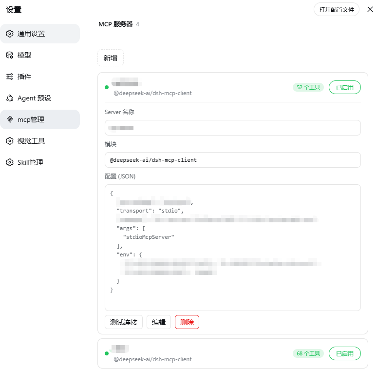

# dsh-toolkit

[English](README.md) | [中文](README_CN.md)

DeepSeek Harness (DSH) 插件工具包——**一条命令**安装两个常用插件：mcp管理 与 Skill管理。装完即用，设置页自动出现 **mcp管理** 与 **Skill管理** 两个分区。

[](https://www.npmjs.com/package/@wanghailong0419/dsh-toolkit)
[](LICENSE)

## 展示

| mcp管理 | Skill管理 |
|---|---|
|  |  |

## 功能

### 🧩 mcp管理 —— 设置 → mcp管理
- **列表总览**：每个 server 显示连接状态（绿点）+ 已注册工具数
- **点击展开 / 收起**：点击行任意位置展开详情（Server 名称 / 模块 / 配置 JSON），再点收起（输入框与按钮除外）
- **新增 / 编辑 / 删除 / 改名 / 启停**：内联表单配置 MCP server，启用/停用开关，写入 `$DSH_HOME/profiles/web/cordis.patch.yml`
- **测试连接**：独立发起 MCP 握手（initialize + tools/list），验证可达性、工具数与延迟
- **缓存优化**：切走再切回状态秒开（stale-while-revalidate），增删改本地更新不闪烁

### 🎯 Skill管理 —— 设置 → Skill管理
- **列表总览**：列出 `$DSH_HOME/skills` 下全部 Skill（名称 + 描述）
- **点击展开 / 收起**：点击行任意位置展开详情（Skill 名称 + SKILL.md 内容）
- **编辑 / 改名 / 新增 / 删除**：内联编辑名称与内容，改名同步重命名目录，删除有二次确认
- **启用 / 停用**：开关即生效；停用时 frontmatter 加 `disable-model-invocation: true`，watcher 立即从模型目录排除，无需重启

## 安装

```bash
dsh plugin --profile web add @wanghailong0419/dsh-toolkit
dsh web   # 重启生效
```

## 包含内容

| 包 | 版本 | 入口 |
|---|---|---|
| [@wanghailong0419/dsh-mcp-manager](https://github.com/LongSir0419/dsh-mcp-manager) | ^0.1.3 | 设置 → **mcp管理** |
| [@wanghailong0419/dsh-skill-manager](https://github.com/LongSir0419/dsh-skill-manager) | ^0.1.4 | 设置 → **Skill管理** |

## 单独安装 / 移除

```bash
# 单独安装
dsh plugin --profile web add @wanghailong0419/dsh-mcp-manager
dsh plugin --profile web add @wanghailong0419/dsh-skill-manager

# 移除整个工具包
dsh plugin --profile web remove @wanghailong0419/dsh-toolkit

# 升级
dsh plugin --profile web update @wanghailong0419/dsh-toolkit
```

## License

MIT
